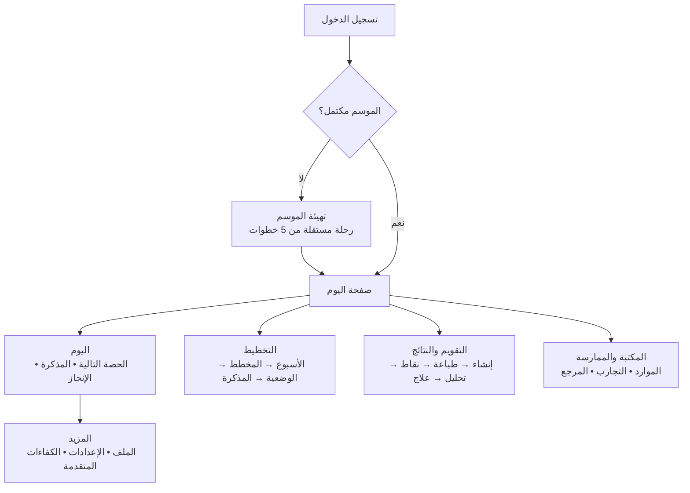

# نبراس — وصف تقني وتحليل بنية الواجهات للعرض على خبير

**الإصدار محل المراجعة:** `b033feda`  
**تاريخ الوثيقة:** 20 أوت 2026  
**إعداد:** Manus AI  
**المنصة المنشورة:** [nibrasai-ktdz6wzy.manus.space](https://nibrasai-ktdz6wzy.manus.space)

## 1. الغرض من الوثيقة

هذه الوثيقة تعرض الوضع التقني والتجريبي الراهن لمنصة **نبراس** أمام خبير تصميم منتجات تعليمية أو هندسة برمجيات. الغاية ليست طلب إعادة بناء المنصة من الصفر، بل الحصول على رأي مهني حول **إعادة تنظيم الواجهات وتخفيف تداخل الصفحات** مع الحفاظ على الوظائف والبيانات والمنهج الرسمي الموجودة بالفعل.

> **المنتج المقصود:** نبراس مساعد تدريس خاص بأستاذ واحد لمواد التاريخ والجغرافيا والتربية المدنية في التعليم المتوسط الجزائري. وهو ليس نظام إدارة مؤسسة ولا منصة تعاون متعددة المستخدمين.

| السؤال المطلوب من الخبير | قرار مطلوب لاحقاً |
|---|---|
| هل تصنيف الصفحات الحالي يعكس طريقة عمل الأستاذ فعلاً؟ | اعتماد هيكل معلومات مبني على مهام الأستاذ لا على الوحدات التقنية |
| أين تقع الازدواجية أو التراكم؟ | دمج نقاط الدخول والصفحات المتشابهة دون حذف البيانات أو قدرات التوليد |
| ما أقل إعادة تنظيم تحقق أكبر أثر؟ | تحديد نطاق موجة تطوير أولى قابلة للتسليم دون إعادة كتابة المنصة |
| ما الذي يجب أن يبقى ثابتاً؟ | المنهاج الرسمي، المخرجات PDF، بيانات الموسم، دعم العربية والهاتف |

## 2. صورة تنفيذية مختصرة

نبراس تطبيق ويب كامل مبني بهيكل حديث: واجهة React أحادية الصفحة، وخادم Express، وواجهة إجراءات tRPC، وقاعدة MySQL/TiDB عبر Drizzle ORM. التطبيق متصل بمصادقة Manus OAuth، ويحتوي على طبقة توليد وطباعـة PDF عربية باستخدام XeLaTeX، مع تخزين كائنات S3 للملفات. [1] [2] [3]

المشكلة الحالية **ليست نقص الوظائف**؛ بل أن عدد نقاط الدخول نما تدريجياً مع نمو المنتج. توجد صفحة اليوم، والتهيئة الموسمية، والتخطيط الأسبوعي، والمخططات السنوية، والدروس، والوضعيات، والمكتبة، والتقويم، والنتائج، ودفتر التنقيط، والكفاءات، ودفتر التجارب. كل صفحة مبررة وظيفياً، لكن بعض الحدود بينها لا تكون واضحة للأستاذ في بداية الموسم أو أثناء يوم العمل.

| المؤشر التقني الحالي | الوضع |
|---|---:|
| صفحات الواجهة المباشرة | 27 صفحة React/TSX |
| عناصر التنقل الرئيسة في سطح المكتب | 9 عناصر |
| إجراءات الهاتف السريعة الثابتة | 4 عناصر |
| جداول مخطط البيانات | 22 جدولاً |
| اختبارات الخادم والوحدات | 25 ملف اختبار، و265 اختباراً ناجحاً في آخر تحقق |
| ملف إجراءات الخادم المركزي | نحو 3,045 سطراً في `server/routers.ts` |

الأرقام السابقة هي جرد للكود الحالي وليست مؤشراً لجودة المنتج وحدها. لكنها تبين أن المنتج تجاوز مرحلة النموذج البسيط، ويحتاج الآن إلى **هندسة معلومات واضحة** تفصل بين: تهيئة الموسم، العمل اليومي، التخطيط التربوي، التقويم والنتائج، والمكتبة المهنية.

## 3. البنية التقنية الحالية

يُبنى العميل بواسطة Vite، ويشغّل الخادم في التطوير عبر `tsx watch`، ثم تُنتَج ملفات الواجهة والخادم في بناء إنتاجي واحد بواسطة Vite وesbuild. الخادم يبدأ Express، يسجل OAuth ووسيط التخزين، ثم يعرّض `appRouter` عبر `/api/trpc` ويخدم ملفات الواجهة الثابتة في الإنتاج. [3] [4]

```mermaid
flowchart TB
  T[الأستاذ — هاتف أو حاسوب] --> R[React 19 + Wouter + Tailwind RTL]
  R --> L[DashboardLayout
تنقل جانبي + تنقل هاتف سريع]
  R --> Q[React Query + tRPC Client]
  Q --> A[/api/trpc]
  A --> E[Express 4]
  E --> O[Manus OAuth
جلسة Cookie]
  E --> RT[إجراءات نبراس
التخطيط • التقويم • النقاط]
  RT --> D[(MySQL/TiDB عبر Drizzle)]
  RT --> AI[مزودات LLM
RAG وتوليد مضبوط]
  RT --> P[قوالب XeLaTeX
PDF عربي رسمي]
  RT --> S[S3
الملفات والمخرجات]
```

| الطبقة | التقنية | المسؤولية الحالية | ملاحظة للخبير |
|---|---|---|---|
| واجهة المستخدم | React 19، TypeScript، Tailwind 4، shadcn/Radix | الشاشات RTL، النماذج، الطباعة، التفاعل المتجاوب | بنية جيدة قابلة لإعادة التنظيم دون تغيير تقني جذري |
| التوجيه | Wouter | 23 مساراً خاصاً داخل `DashboardLayout` ومسارات عامة محدودة | المسارات مسطحة؛ لا توجد طبقة «رحلة/Workspace» تنظّمها دلالياً [1] |
| الحالة والبيانات | TanStack React Query + tRPC 11 + Zod | استعلامات ومطفرات مكتوبة الأنواع بين العميل والخادم | مناسب لانتقالات تدريجية وإعادة استخدام الشاشات [3] |
| الخادم | Express 4 + Node ESM | OAuth، tRPC، التخزين، الخدمة الثابتة | الخادم لا يفرض شكلاً محدداً للواجهة؛ إعادة تنظيم UX منخفضة المخاطر نسبياً [4] |
| البيانات | MySQL/TiDB + Drizzle ORM | موسم، أقسام، تلاميذ، خطط، وضعيات، موارد، تقييمات، نتائج | يجب عدم المساس بالنماذج والعلاقات أثناء قرار تنظيم الواجهة |
| الذكاء الاصطناعي | طبقة LLM مع RAG منهجي | توليد مذكرة، نشاط، تقويم، تحليل، مع قواعد محلية | لا ينبغي تحويل المنتج إلى محادثة عامة أو السماح باختلاق محتوى منهجي |
| المخرجات | XeLaTeX + Amiri + polyglossia/bidi | مذكرات وتقويمات PDF عربية A4 | مستقر وظيفياً؛ التقويم رسمي محايد بلا علامة منصة |
| النشر | استضافة Manus Autoscale + PWA | نشر تلقائي عند نقطة الحفظ، تثبيت هاتف، خدمة عدم اتصال آمنة | لا حاجة إلى نقل الاستضافة لمعالجة مشكلة التداخل |

## 4. خريطة المنتج كما هي الآن

يتجه المسار الحالي من `/` إلى `/dashboard`. كل المسارات العملية تقريباً مغلفة داخل `DashboardLayout`، لذلك تبقى قائمة سطح المكتب أو قائمة الهاتف السريعة ظاهرة حتى داخل رحلة موجهة مثل «تهيئة الموسم». [1] [2]

| المجال الوظيفي | الصفحات أو المسارات الحالية | الهدف التربوي الصحيح |
|---|---|---|
| بداية العمل اليومي | `/dashboard`، `/weekly-plan` | معرفة الحصة التالية، الوضعية، التنفيذ أو التأجيل |
| بداية الموسم | `/season-setup`، `/profile`، `/classes`، استيراد التلاميذ، الجدول | إدخال بيانات الأستاذ والمؤسسة والأقسام والتلاميذ وجدول الخدمة مرة واحدة |
| التخطيط البيداغوجي | `/annual-plans`، `/annual-plans/:id`، `/lessons`، `/lessons/:id`، `/integrative-situation` | الانتقال الهرمي: مادة → مقطع → كفاءة → وضعية → مذكرة |
| الإنتاج الصفي | `/lesson-generator`، `/assessment`، `/content-library/:id` | إنشاء مذكرات وأنشطة وتقويمات، ثم معاينتها وطباعتها |
| القياس والعلاج | `/gradebook`، `/student-results`، `/results`، `/competencies` | تدوين العلامات، متابعة الأداء، اتخاذ قرار علاجي |
| الممارسة المهنية | `/experiment-log`، `/curriculum`، `/inspector` | حفظ الاستراتيجيات، الرجوع للمرجع، فحص الجودة |
| صفحات عامة / مساندة | `/brand`، `/verify`، `/verify/answer/:serial` | هوية أو تحقق عام، وليست مهاماً يومية للأستاذ |

المشكلة لا تكمن في وجود هذه المجالات، بل في أنها تعرض بمستويات متقاربة من الأهمية. في الواقع، لا يحتاج الأستاذ يومياً إلى «الكفاءات» أو «دفتر التجارب» بالطريقة نفسها التي يحتاج فيها إلى «اليوم»، كما أن تهيئة الموسم ليست صفحة عادية ينبغي أن تنافس مهام اليوم في شريط تنقل واحد.

## 5. التهيئة الموسمية الجديدة

تمت إضافة مسار موسمي من خمس خطوات داخل `/season-setup` ليعكس الترتيب الطبيعي في بداية الموسم: بيانات الأستاذ والمؤسسة، الأقسام والمستويات، قوائم التلاميذ، جدول الخدمة، ثم المراجعة والانطلاق. المسار يعيد فتح أول خطوة ناقصة منطقياً اعتماداً على اكتمال الملف، ووجود الأقسام، ثم وجود الجدول المحفوظ. هذه خطوة صحيحة، لكنها لا تزال تعمل **داخل الهيكل الملاحي العام** نفسه.

| الخطوة | البيانات | مصدر الحفظ/إعادة الاستعمال | النتيجة |
|---|---|---|---|
| 1. الأستاذ والمؤسسة | الاسم، المؤسسة، الولاية، السنة الدراسية | الملف الشخصي | ترويسة الوثائق الرسمية وسياق الموسم |
| 2. الأقسام والمستويات | مستوى، قسم، عدد التلاميذ | بيانات الأقسام | ربط القسم بمنهجه ووضعياته الجاهزة |
| 3. قوائم التلاميذ | استيراد الرقمنة أو إدخال محدود | التلاميذ/الأقسام | دفتر التنقيط والمتابعة |
| 4. الجدول الأسبوعي | يوم، وقت، قسم، مادة | الجدول المحفوظ | اقتراح الحصة التالية في «اليوم» |
| 5. مراجعة وانطلاق | ملخص الإنجاز | لا تُنشئ بيانات مستقلة | الانتقال الواعي إلى صفحة اليوم |

> **الملاحظة المهمة:** المسار الموسمي يجب أن يكون تجربة موجهة «Wizard» شبه مستقلة، لا صفحة فرعية أخرى ضمن قائمة تتضمن في الوقت ذاته جميع أدوات المنتج. هذا لا يعني حجب القائمة دائماً؛ بل تقليل منافسة التنقل أثناء إكمال التهيئة وإبقاء مخرج واضح: «حفظ والخروج إلى اليوم».

## 6. تشخيص التداخل والتراكم

### 6.1 التداخل في هندسة المعلومات

هناك أكثر من صفحة تؤدي إلى نية ذهنية واحدة. مثلاً، «التخطيط» في الشريط يفتح المخططات السنوية، بينما توجد صفحة الأسبوع، وصفحات الدروس، والوضعيات، ومولد الدرس. كل واحدة صحيحة على مستوى البيانات، لكن الأستاذ قد لا يعرف أين يبدأ عندما يقول: *«أريد تحضير حصة الغد»*.

| التداخل المرصود | أثره على الأستاذ | السبب البنيوي المرجح | المعالجة المناسبة |
|---|---|---|---|
| الموسم بين التهيئة، الملف، الأقسام، التلاميذ، والجدول | لا يدرك ما يجب فعله أولاً | النمو كصفحات وظائف مستقلة | بوابة موسم واحدة وخطوات موجهة وروابط سياقية فقط |
| التخطيط بين الأسبوع، المخططات، الدروس، والوضعيات | يبحث بين صفحات بدل متابعة تسلسل تربوي | فصل الواجهات بحسب الجداول/الكيانات | مساحة «التخطيط» بهرم واضح وتدرج داخلها |
| القياس بين التقويم، النتائج، دفتر التنقيط، والكفاءات | قد يخلط بين إنشاء اختبار وتسجيل نقاط وتحليلها | عناوين تقنية متجاورة | مساحة «التقويم والنتائج» بمراحل متتابعة |
| الموارد بين مولد الدرس، المكتبة، تفاصيل المورد، دفتر التجارب | لا يتضح الفرق بين الإنشاء والحفظ وإعادة الاستخدام | تطور الميزات باستقلال | فصل «أنشئ» عن «راجع/أعد استخدام» مع روابط لاحقة |
| الهاتف بين الشريط السفلي وقائمة جانبية كاملة وصفحات كثيفة | عناصر كثيرة في مساحة صغيرة | الحفاظ على تنقل سطح المكتب مع اختصار موازٍ للهاتف | شريط سفلي من 3–4 نيات عالية التردد فقط، وبقية الأدوات تحت «المزيد» |

### 6.2 التداخل في التنفيذ البصري

القائمة الجانبية في سطح المكتب تعرض تسع وجهات رئيسية، والشريط السفلي في الهاتف يعرض أربع وجهات. ثم تضيف كل صفحة عنوانها وإجراءاتها وبطاقاتها واختصاراتها. عند وضع خطوة موجهة داخل هذا الإطار—كما في تهيئة الموسم—يصبح أمام الأستاذ في اللحظة نفسها: **خمس خطوات داخلية + أربعة اختصارات هاتف + زر القائمة + روابط داخل الصفحة**. هذا هو سبب الإحساس بالتراكم، حتى عندما يكون كل عنصر مفيداً منفرداً. [2]

### 6.3 التداخل في طبقة الكود

الطبقة الأمامية قابلة للصيانة، لكن `server/routers.ts` أصبح ملفاً مركزياً كبيراً نسبياً. لا يسبب ذلك ازدحام الواجهة مباشرة، إلا أنه يجعل تداخل المجالات أكثر احتمالاً عند إضافة مسار جديد. كذلك، تعريف جميع المسارات في `App.tsx` بصورة مسطحة يجعل مسميات المجال وملاكها غير ظاهرة في البنية نفسها. [1]

| ما يجب تغييره أولاً | ما يجب تأجيله |
|---|---|
| تسمية المساحات والمهام وفق لغة الأستاذ | تغيير قاعدة البيانات أو إعادة نمذجة المنهاج |
| تجميع التنقل في 4–5 مجموعات عقلية | استبدال React أو tRPC أو Vite |
| جعل التهيئة رحلة مستقلة مشروطة | نقل الاستضافة أو تغيير المصادقة |
| إضافة روابط انتقال «الخطوة التالية» بين التخطيط والتقويم والنقاط | تفكيك الخادم كاملاً قبل تثبيت هيكل المنتج |
| تقسيم `routers.ts` تدريجياً حسب المجال بعد تثبيت الهيكل | إعادة كتابة مولد PDF أو RAG المستقرين |

## 7. الهيكل المقترح للنسخة التالية

يوصى بالخيار المتوسط: **إعادة تنظيم المنتج حول مهام الأستاذ** مع الإبقاء على الصفحات والمكونات والبيانات الحالية حيث أمكن. لا يوصى بإخفاء القدرات المتقدمة، بل بوضعها في موضع طبيعي لا يزاحم مهمة اليوم.



| المساحة المقترحة | محتواها الأساسي | ما ينتقل تحتها أو إليها |
|---|---|---|
| **اليوم** | الحصة التالية، حالة القسم، المذكرة، تنفيذ/تأجيل، اختصار التقويم | Dashboard وقرار الحصة اليومي |
| **التخطيط** | الأسبوع، المخططات السنوية، الوضعيات، الدروس | Weekly Plan، Annual Plans، Lessons، Integrative Situation، مولد الدرس كسياق إنشاء |
| **التقويم والنتائج** | إنشاء التقويم، PDF، دفتر التنقيط، نتائج، علاج | Assessment، Gradebook، Student Results، Results، Competencies |
| **المكتبة والممارسة** | موارد محفوظة، دفتر التجارب، المنهاج | Content Library، Experiment Log، Curriculum |
| **المزيد** | الملف، التهيئة الموسمية، أدوات قليلة الاستخدام | Profile، Season Setup، فحص الجودة/Inspector، صفحات مساندة |

هذه الخريطة لا تعني أن كل مجال يجب أن يصبح صفحة واحدة ضخمة. المقصود أن يرى الأستاذ أولاً **اسماً واحداً لمعنى واحد**، ثم ينتقل داخل المجال عبر تبويبات أو مسار فرعي أو أزرار «التالي». مثلاً: «التخطيط» يبدأ من ما يحتاجه هذا الأسبوع، ثم يسمح بالوصول إلى المخطط والوضعية، بدلاً من وضع كل مستوى هرمي كخيار رئيسي مستقل.

## 8. خيارات التنفيذ وقرار مقترح

| الخيار | نطاق العمل | المزايا | المخاطر | التقدير |
|---|---|---|---|---|
| أ. تحسين سطحي | إعادة تسمية القائمة، إخفاء بعض العناصر في «المزيد»، تنسيق العناوين | سريع وقليل المخاطر | لا يعالج الانتقالات والازدواج جذرياً | غير كافٍ وحده |
| ب. إعادة تنظيم موجهة بالمهام **(موصى بها)** | مجموعات تنقل جديدة، صفحات Hub، رحلة موسم مستقلة، روابط خطوة تالية، إعادة استعمال المكونات | أكبر أثر على الوضوح دون تغيير بيانات أو منطق أعمال | يحتاج قراراً دقيقاً حول عناوين المجموعات | الخيار الأنسب |
| ج. إعادة تصميم جذرية | توجيه متداخل، تقسيم كبير للمجلدات والخادم، إعادة بناء شاشات رئيسية | بنية طويلة الأجل أنظف | تكلفة ومخاطر عالية على منتج في فترة موسم | تؤجل إلى ما بعد اختبار الخيار ب |

التوصية هي بدء الخيار **ب** على موجتين. الموجة الأولى تضبط التنقل ومسار تهيئة الموسم وصفحات Hub فقط، وتبقي المسارات القديمة تعمل كي لا ينقطع الأستاذ. الموجة الثانية تنقل كل رحلة إلى الداخل تدريجياً وتفكك إجراءات الخادم حسب المجالات بعد استقرار التصميم.

| الموجة | التغيير | معيار النجاح |
|---|---|---|
| 1. الأساس الملاحي | 4 مساحات رئيسية + «المزيد»، تهيئة مستقلة، روابط انتقال صريحة | يستطيع الأستاذ وصف مكانه وما الخطوة التالية في كل شاشة |
| 2. رحلة التخطيط | دمج بداية الأسبوع والمخطط والوضعية في سياق واحد | يصل إلى المذكرة من «اليوم» أو «التخطيط» بعدد نقرات أقل |
| 3. رحلة التقويم | ربط إنشاء التقويم والنقاط والنتائج والعلاج | لا يخلط الأستاذ بين الاختبار، التقويم المستمر، والنتيجة |
| 4. صيانة الكود | تقسيم `routers.ts` ومجلدات الصفحات حسب المجالات | يصبح تطور الميزات أقل عرضة لخلق صفحة معزولة جديدة |

## 9. قيود يجب احترامها في أي إعادة تنظيم

لا ينبغي أن يؤدي التحسين البصري إلى فقدان قواعد المنتج التربوية أو متطلبات الوثائق الرسمية. ينبغي الحفاظ على المحتوى المنهجي الجزائري المرجعي، وسلسلة العمل التربوية، والبيانات الموجودة، وقواعد الطباعة الحالية.

| قيد ثابت | التفسير |
|---|---|
| العربية وRTL أولاً | الهاتف والواجهة العربية هما حالة الاستخدام الأساسية، لا تعريب لاحق لواجهة لاتينية |
| أستاذ واحد لكل مساحة | لا توجد حاجة حالية إلى أدوار مدير أو مفتش أو فرق عمل |
| تسلسل تربوي ثابت | قسم → خطة → مقطع → وضعية → مذكرة → تنفيذ → تقويم → نتائج → علاج |
| المنهاج مرجع وليس اقتراحاً | الذكاء الاصطناعي لا يخترع معلومات منهجية عند غياب الدليل |
| رسمية المطبوعات | مذكرات وتقويمات PDF محايدة، بلا شعار منصة أو QR أو رقم تسلسلي |
| قاعدة التقويم حسب المستوى | 1AM و2AM بورقة إجابة مدمجة؛ 3AM و4AM بورقة أسئلة مع بقاء الجداول |
| قابلية PWA | تجربة تثبيت الهاتف وخدمة عدم الاتصال الآمنة يجب أن تبقى موجودة |
| حماية البيانات | لا تُصفّر البيانات المرجعية؛ التغييرات تخص تنظيم الوصول لا حذف تاريخ الأستاذ |

## 10. أسئلة دقيقة مقترحة للخبير

يرجى من الخبير الإجابة عن الأسئلة التالية بترتيب أولوية، وتقديم رسم سلكي مختصر إن أمكن، بدل اقتراح تصميم زخرفي منفصل عن تدفق العمل.

1. هل تبدو المجموعات الأربع المقترحة—**اليوم، التخطيط، التقويم والنتائج، المكتبة والممارسة**—طبيعية لأستاذ اجتماعيات متوسط؟
2. هل ينبغي أن تظهر «تهيئة الموسم» كطبقة مستقلة بلا شريط تنقل كامل، أم داخل مساحة «المزيد» مع وضع تركيز خاص؟
3. ما أقل عدد من عناصر الشريط السفلي للهاتف، وما العناصر التي ينبغي أن تبقى فيه فعلاً؟
4. كيف تقترح عرض التسلسل: مخطط سنوي → وضعية → مذكرة، بحيث لا يشعر الأستاذ أنه يدخل ثلاث صفحات متداخلة؟
5. هل تفضل صفحة Hub لكل مجال مع تبويبات، أم شاشات مستقلة مرتبطة بمسارات واضحة و`breadcrumb`؟
6. ما الصفحات التي تعد «متقدمة» ويمكن نقلها من الشريط الأساسي إلى «المزيد» من دون تقليل فاعلية المنتج؟
7. ما مؤشرات القبول العملية التي تقيس أن إعادة التنظيم نجحت مع أستاذ حقيقي على الهاتف؟

## 11. ملاحظات ختامية للخبير

نبراس يمتلك أساساً تقنياً وظيفياً ومحتوى منهجياً ومخرجات مطبوعة خاصة بمجال واضح. لذلك فإن التوصية ليست بناء نظام جديد أو تحويل المنصة إلى لوحة تحكم عامة، بل جعل البنية الظاهرة **تخدم ترتيب عمل الأستاذ**: يهيئ الموسم مرة، يعرف عمل اليوم سريعاً، يخطط من السياق، يقوّم، يسجل النتائج، ثم يعالج التعثر.

> **المعيار الحاسم للتصميم المقترح:** يجب أن يستطيع الأستاذ من الهاتف أن يجيب في أي لحظة عن ثلاثة أسئلة: «أين أنا؟ ماذا أفعل الآن؟ وما الخطوة التالية؟».

## المراجع

[1]: file:///home/ubuntu/nibras/client/src/App.tsx "خريطة مسارات React الحالية"
[2]: file:///home/ubuntu/nibras/client/src/components/DashboardLayout.tsx "التنقل الجانبي والهاتف في نبراس"
[3]: file:///home/ubuntu/nibras/package.json "الحزم والبرامج النصية للمشروع"
[4]: file:///home/ubuntu/nibras/server/_core/index.ts "تهيئة Express وtRPC وOAuth والخدمة الثابتة"
[5]: file:///home/ubuntu/nibras/todo.md "سجل التنفيذ والتحقق الأخير للمشروع"
